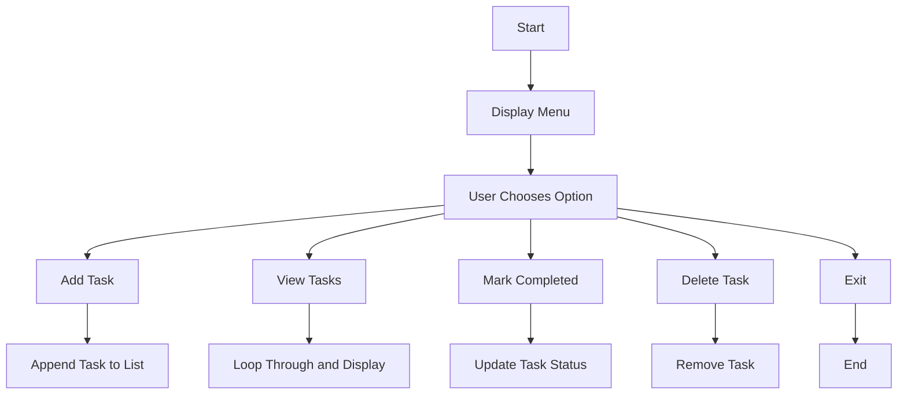

 # Interactive Programming Learning Framework

## Overview
The **Interactive Programming Learning Framework** is a structured YAML-based system designed to teach programming effectively. It integrates three key components—**Flowcharts**, **Pseudocode**, and **Code**—layered together to create an intuitive and engaging learning experience. This framework caters to both learners and intelligent chatbots, guiding them through a logical and systematic approach to understanding programming.

## Features
### 🚀 Layered Visualization System
The framework introduces a step-by-step learning model:
1. **Flowchart**: Provides a visual representation of the application's logic.
2. **Pseudocode**: Adds logical instructions to describe the flow in detail.
3. **Code**: Implements the logic in one or more programming languages.

### 🎯 Key Benefits
- Offers an intuitive and structured way to understand programming concepts.
- Assists learners in visualizing the entire process, from design to implementation.
- Provides chatbot training capabilities, enabling chatbots to teach programming interactively.

### 🔄 Flexible for All Levels
- Beginner-friendly exercises such as "Hello World."
- Advanced tasks like building a functional To-Do List application.
- Includes annotations to connect each layer (flowchart, pseudocode, code).

## Structure
The YAML file is organized as follows:
- **`visualization_layers`**: Details each layer (Flowchart → Pseudocode → Code) with examples.
- **`tasks`**: Defines programming exercises for learners, categorized by difficulty levels.
- **`chatbot_training`**: Guidelines for training chatbots to teach programming.
- **`additional_features`**: Enhancements for interactive and customized learning.

## Example Flow
Here is an example learning process using the To-Do List Application:

### **1. Flowchart**


### **2. Pseudocode**
```plaintext
- Initialize an empty list to store tasks.
- Show menu with the following options:
    - Add Task
    - View Tasks
    - Mark Completed
    - Delete Task
    - Exit
- Perform actions based on user choice:
    - If "Add Task", prompt for task and append it to the list.
    - If "View Tasks", loop through the list and display each task.
    - If "Mark Completed", ask for task index and update its status.
    - If "Delete Task", ask for task index and remove the task.
```

### **3. Code (Python Example)**
```python
def todo_list_app():
    tasks = []
    while True:
        print("\nMenu:")
        print("1. Add Task")
        print("2. View Tasks")
        print("3. Mark Task as Completed")
        print("4. Delete Task")
        print("5. Exit")

        choice = input("Choose an option (1-5): ")
        if choice == "1":
            task = input("Enter task description: ")
            tasks.append({"description": task, "completed": False})
            print("Task added!")
        elif choice == "2":
            print("\nTasks:")
            for index, task in enumerate(tasks, start=1):
                status = "Completed" if task["completed"] else "Not Completed"
                print(f"{index}. {task['description']} - {status}")
        elif choice == "3":
            index = int(input("Enter task number to mark as completed: ")) - 1
            if 0 <= index < len(tasks):
                tasks[index]["completed"] = True
                print("Task marked as completed!")
            else:
                print("Invalid task number.")
        elif choice == "4":
            index = int(input("Enter task number to delete: ")) - 1
            if 0 <= index < len(tasks):
                tasks.pop(index)
                print("Task deleted!")
            else:
                print("Invalid task number.")
        elif choice == "5":
            print("Goodbye!")
            break
        else:
            print("Invalid option, please try again.")
```

## How to Use
1. **Prepare YAML**: Define your programming tasks, flowcharts, pseudocode, and examples in the provided YAML format.
2. **Run Interactive Learning**: Visualize the content layer-by-layer to understand the logic and implementation.
3. **Train Chatbots**: Use the `chatbot_training` section to guide chatbots in delivering programming lessons.

## Contribution
Contributions are welcome! Feel free to:
- Suggest new tasks or enhancements.
- Improve existing examples or provide additional pseudocode/code translations.
- Share feedback to make the framework even more user-friendly.

## License
This framework is open-source and available for use and customization under the [MIT License](https://opensource.org/licenses/MIT).
